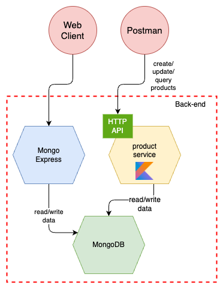

= Kotlin - Hands On

[.columns]
== Agenda

[.column]
--
* Intro
* Project setup
* Hands-on
* Q&N
--

[.column]
--

--

== Intro

=== About me

* Simon Dietschi
* Coding Architect
* Kotlin enthusiast

=== Motivation

* Write fewer lines of code
* Maintainability
* Reduction of runtime-mistakes
* Enjoy Kotlin

== Project setup

=== New...

[source,bash]
----
spring init \
    -a products \
    -g io.dietschi.edu.products \
    -l kotlin \
    --build maven \
    spring-kotlin-demo
----

Or: link:https://start.spring.io/[]

=== Overview

== Hands-on

Repo: link:https://github.com/polster/spring-kotlin-handson[]

== Q&N

image::thats-all-folks.png[folks,400]